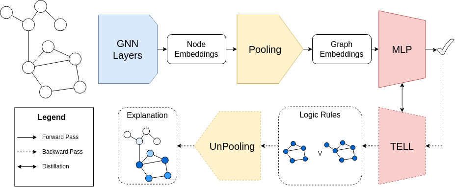

# Faithful Explanations for Graph Classification using Logic
Official Repository of the ECML-PKDD 2025 Paper "Faithful Explanations for Graph Classification using Logic"

## Model Training

To train a single model:
`python train_baseline.py`

To perform a grid search:
`python optimize_baseline.py`

## Explanations

To replicate experiments and explain the model with all the methods in the paper use the notebook `PostHoc.ipynb` to save explanations and `Results.ipynb` to gather the results.
